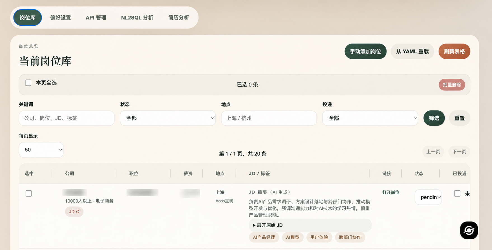

# Job Radar

Job Radar 是一个本地优先的岗位管理与简历分析工具。它把 YAML 数据、SQLite、本地脚本和一个 Web 控制台收在同一套工作流里，适合在本机持续维护岗位库、筛选职位、做 NL2SQL 查询，以及用简历反向匹配岗位。




## 已实现功能

- 岗位库管理：读取并同步 `internships.yaml`，在 Web 页面里查看、编辑、筛选、批量处理岗位
- 偏好配置：直接维护 `internship-prefs.yaml`，供抓取与筛选逻辑复用
- 职位抓取：通过 `scripts/fetch_job_links.py` 从 BOSS直聘抓取职位结构化信息
- JD 原文提取：通过 `scripts/fetch_jd_dom.py` 在 macOS + Chrome 下抓取 DOM 中的完整 JD
- AI 摘要与标签：通过 `scripts/summarize_jds.py` 生成 JD 摘要、标签和质量评级
- NL2SQL 分析：在网页里用自然语言查询岗位库，并展示 SQL 与结果表格
- 简历分析：上传简历后转成 Markdown，自动匹配岗位、生成改进建议，并支持多轮对话
- 简历缓存恢复：项目根目录已有 `resume.md` 时，刷新页面会自动恢复；重新上传会覆盖旧缓存

## 快速启动

```bash
python3 -m pip install -r requirements.txt
python3 app.py --host 127.0.0.1 --port 8765
```

启动后访问 `http://127.0.0.1:8765`

## 页面模块

- 岗位库：查看、筛选、编辑、同步 YAML 数据
- 偏好设置：维护抓取和筛选偏好
- API 管理：配置兼容 OpenAI Chat Completions 的模型接口
- NL2SQL 分析：对岗位库做自然语言查询
- 简历分析：上传或自动读取 `resume.md`，做岗位匹配和多轮问答

## 常用脚本

```bash
python3 scripts/fetch_job_links.py --prefs internship-prefs.yaml --yaml internships.yaml
python3 scripts/fetch_jd_dom.py --yaml internships.yaml --limit 5 --min-delay 2.0 --max-delay 5.0
python3 scripts/summarize_jds.py --list-pending
python3 scripts/summarize_jds.py --dry-run
python3 scripts/dedup_check.py --yaml internships.yaml
```

## 运行依赖

- Python 3
- `requirements.txt` 中的依赖，尤其是 `PyYAML`、`aiohttp`、`markitdown[all]`
- 如果要抓取 JD 原文，需要 macOS、Google Chrome，以及开启 `View > Developer > Allow JavaScript from Apple Events`

## 项目结构

```text
.
├── app.py
├── web/
├── scripts/
├── references/
├── internships.yaml
├── internship-prefs.yaml
├── resume.md
└── requirements.txt
```

## 数据与缓存

- `internships.yaml`：岗位源数据
- `internship-prefs.yaml`：抓取与筛选偏好
- `resume.md`：当前简历 Markdown 缓存
- `resume_advice.json`：简历分析会话缓存
- 本地 SQLite 数据库：Web 控制台运行时自动维护

## 开发提示

- 修改 `app.py` 后需要重启服务
- 前端静态资源改动后直接刷新页面即可
- 如果 `8765` 被占用，可通过 `--port` 切换端口
